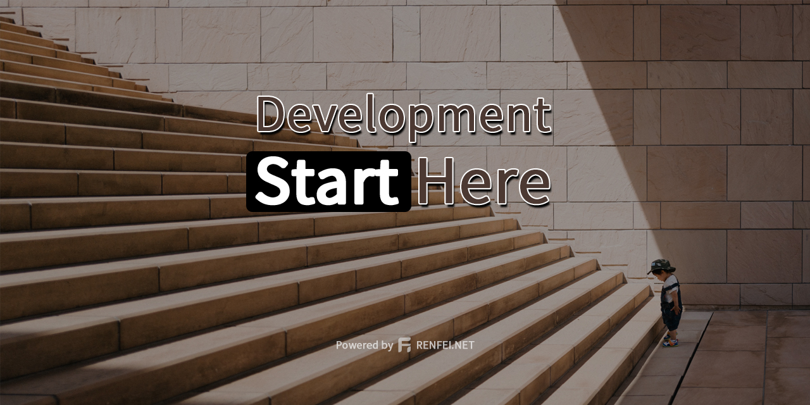

[English](README.md) | [简体中文](README_zh_CN.md)

# start-ui



[](https://github.com/renfei/start-ui/actions/workflows/build.yml)


This project is a sub-project of [Start](https://github.com/renfei/start), as the front-end and back-end separate development and the matching front-end UI interface provided by the main project RESTful API interface.
I am not a front-end professional, this project is for reference only.

## Project Repository

- Github: [https://github.com/renfei/start-ui](https://github.com/renfei/start-ui)
- Gitee: [https://gitee.com/rnf/start-ui](https://gitee.com/rnf/start-ui)
- Gitlab: [https://gitlab.com/renfei/start-ui](https://gitlab.com/renfei/start-ui)

## Technology Selection

### Vue.Js

The Progressive JavaScript Framework。

### Vuetify

Vuetify is a Vue UI Library with beautifully handcrafted Material Components. No design skills required — everything you need to create amazing applications is at your fingertips.

### Material Design

Material is an adaptable system of guidelines, components, and tools that support the best practices of user interface design. Backed by open-source code, Material streamlines collaboration between designers and developers, and helps teams quickly build beautiful products.

### vue-i18n

Supports multi-language internationalization, and only needs to translate language packs to be compatible with different language environments.

## Project setup
```
yarn install
```

### Compiles and hot-reloads for development
```
yarn serve
```

### Compiles and minifies for production
```
yarn build
```

### Lints and fixes files
```
yarn lint
```

### Customize configuration
See [Configuration Reference](https://cli.vuejs.org/config/).
