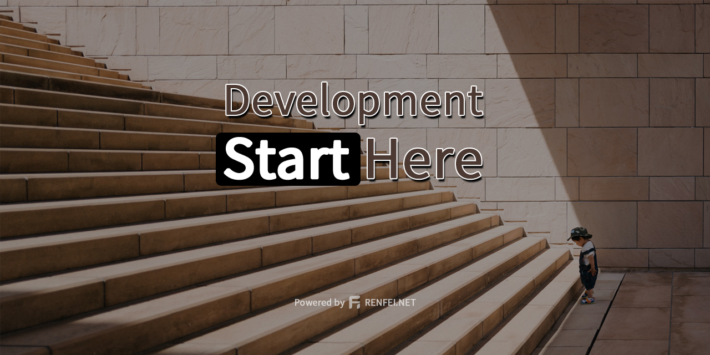

[English](README.md) | [简体中文](README_zh_CN.md)

# start-ui



[](https://github.com/renfei/start-ui/actions/workflows/build.yml)


本项目是 [Start](https://github.com/renfei/start) 的子项目，作为前后端分离开发而配合主项目 RESTful API 接口提供的配套前端UI界面。
本人并非前端专业，此项目仅供参考使用。

## 技术选型

### Vue.Js

渐进式 JavaScript 框架。

### Vuetify

Vuetify 是一个纯手工精心打造的 Material 样式的 Vue UI 组件库。 不需要任何设计技能 — 创建叹为观止的应用程序所需的一切都触手可及。

### Material Design

Material 是由 Google 推出的一个适应性强的指南、组件和工具系统，支持用户界面设计的最佳实践。在开源代码的支持下，Material 简化了设计人员和开发人员之间的协作，并帮助团队快速构建精美的产品。

### vue-i18n

支持多语言国际化，只需翻译语言包即可兼容不同语言环境。

## 项目开始

```
yarn install
```

### 编译并重新加载以进行开发
```
yarn serve
```

### 为生产环境编译和压缩
```
yarn build
```

### Lints和fixes文件
```
yarn lint
```

### 自定义配置
参考 [Configuration Reference](https://cli.vuejs.org/config/).